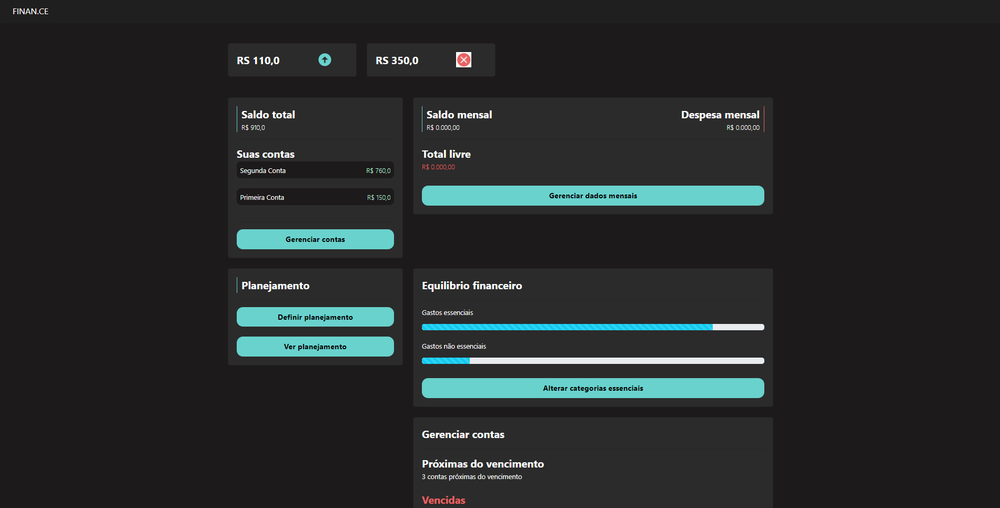

# gerenciador_financeiro

Desenvolvido durate a PYSTACK WEEK 7.0.

O Projeto consistiu na criação de um gerenciador financeiro. Nele, é possível criar uma conta, registrar entradas e saídas, definir um planejamento financeiro, estabelecer limites de gastos para categorias cadastradas, acompanhar contas próximas do vencimento e muito mais.


### Pré-requisitos

- Python 3

### Instalação

A instalação pode ser realizada utilizando 2 passos simples. O primeiro consiste em realizar o clone do repositorio utilizando o seguinte comando.

```sh
git clone git@github.com:IgorDiasV/gerenciador_financeiro.git
```

O próximo passo consiste em instalar as dependências do Python 

```sh
pip install -r requeriments.txt
```

### Interface

A interface principal pode ser visto na imagem abaixo.

